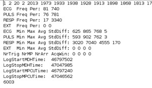

# Creating physiology regressors using the PhysIO toolbox

October 2023; additional info and further read: https://www.sciencedirect.com/science/article/pii/S016502701630259X?via%3Dihub 

## _Acquistion of log-files:_

### _Physiology logging:_

+ Press tab + [-> + Entf to enter admin mode
+ PMU control
+ control-esc
+ run -> cmd
+ in the terminal, type ideacmdtool
+ DON'T use startLogAll, start puls and ECG separately (if both are started simultaneously, recording will terminate after 5 min.)
+ After a while there should be a message with “ok” at the end
+ Data is stored in `C:\ProgramFiles\Siemens\Numaris\ Mars\log\` (there is a shortcut “log” in the Explorer )
+ Stop recording after experiment with stopLogAll, move data to `C:\_Natalia\STUDYNAME`

## _Required:_ 
+ Json- files of functional data for each run
+ Physiology log-files, one for all runs (.resp and .puls files)

**Figure 1.**  Puls and resp-file.

+	Script: `/storage/nv_shared/PhysIO_excitex/PhysIO_get_regressors.m`

## _Before running the script:_
+	Always check if on path:
SPM: `/usr/local/spm12/ `
Toolbox-code modified for our scanner model: `/storage/nv_shared/software/PhysIO/tapas-master/PhysIO/code`

+ Individual parameter settings in the script: 
  - `physio.log_files.vendor` = 'Siemens_xa20'; % specific for our scanner model. 
  - `physio.log_files.resp_type` = 'spine'; % set to spine or belt, depending on type of physiology correction. 
  -	`physio.model.orthogonalise` = 'RETROICOR'; % select depending on physiology model used, e.g. 'RETROICOR', or c, r; to avoid correlations between regressors.
  -	`physio.model.retroicor.include` = true; % select physiology model here: RETROICOR, RVT or HVT.
  - `physio.model.retroicor.order.c` = 3; 
  - `physio.model.retroicor.order.r` = 4;
  - `physio.model.retroicor.order.cr` = 1; % select orders for RETROICOR model; here the default option based on Glover et al., 2000 is set. 
  - `physio.model.rvt.include` = false; % select physiology model here.
  - `physio.model.hrv.include` = false; % select physiology model here.
  -	`physio.model.other.include` = false; % select physiology model here.
  -	`physio.verbose.level` = 3; % 2 or 3, will produce control plots – useful to check quality of data and  if synchronization has worked; when analyzing several participants it’s best to set to 0.
 

## _After running the script:_ 

+ Validation of results - Check the diagnostic plots the toolbox delivers:
  - Check the raw time series for artifacts/ detachments (4A)
  - Check distribution of raw physiological data (should be left-skewed, 4B), are there any indications for ceiling effects or temporary detachment (2)?  
  - Check period used for synchronization, does it fit? (4C)
  - Check filtered time series (are there still severe artifacts?) 
  - Check regressor file (3): regressors should have a value for each slice and 18 regressors if you specified RETROICOR (i.e., 6 cardiac phase regressors, 8 respiratory phase regressors, and 4 interaction terms). 
  - Regressors can then be added to a GLM.

**Figure 2.** Artifacts in raw respiratory signal due to issues during recording with the breathing belt.

**Figure 3.** Final output (RETROICOR regressors)

**Figure 4.** Steps from raw data to the final regressors.

